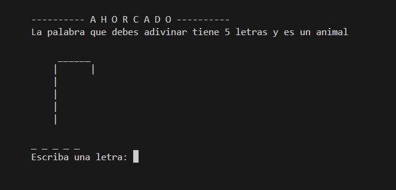
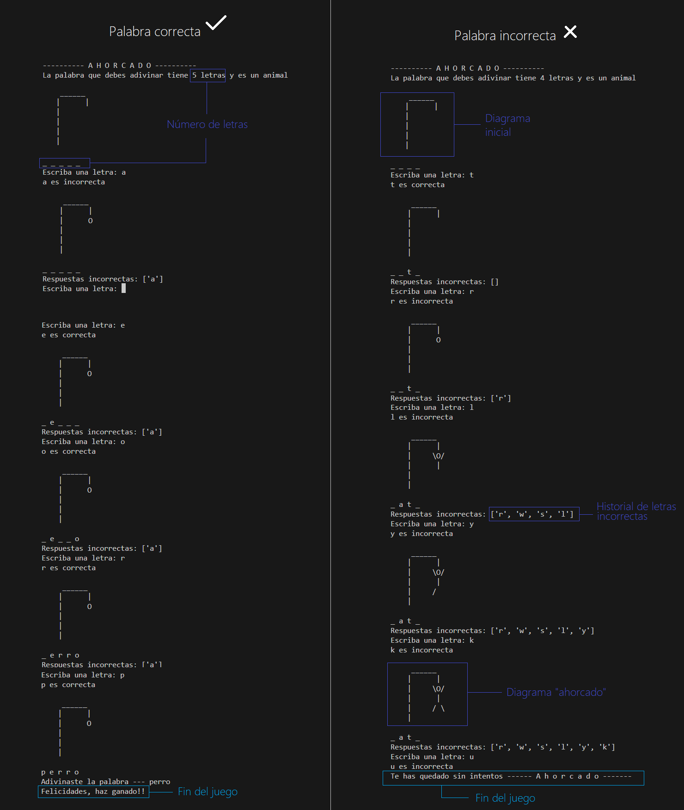

# Ahorcado

## Especificaciones

Ahorcado se desarrolló usando:

- Python

Para iniciar el juego se debe correr el archivo __main.py__ .Una vez que corra el archivo se llevará a cabo el juego en la terminal.

### Jugabilidad:

__Objetivo:__ Debes intentar adivinar la palabra oculta en el menor número de intentos posible.

1. Al iniciar el juego se indica el número de letras de la palabra a adivinar, el diagrama inicial que representa a "la horca" y las líneas correspondientes a las letras de la palabra oculta.

2. En cada turno puedes escoger sólo una letra y escribirla, si la letra está en la palabra, se autocompletará en todos los espacios donde se encuentra. De lo contrario el diagrama cambiará a la forma del "ahorcado" que corresponda. Se podrá ver el historial de respuestas incorrectas y también si la letra es correcta o incorrecta.

3. Si adivinas la palabra ganarás el juego y se mostrará un mensaje de felicitación. Si los intentos se terminan y el diagrama llega a "ahorcado" el juego termina

__NOTA__ Para reiniciar el juego se debe volver a correr.
